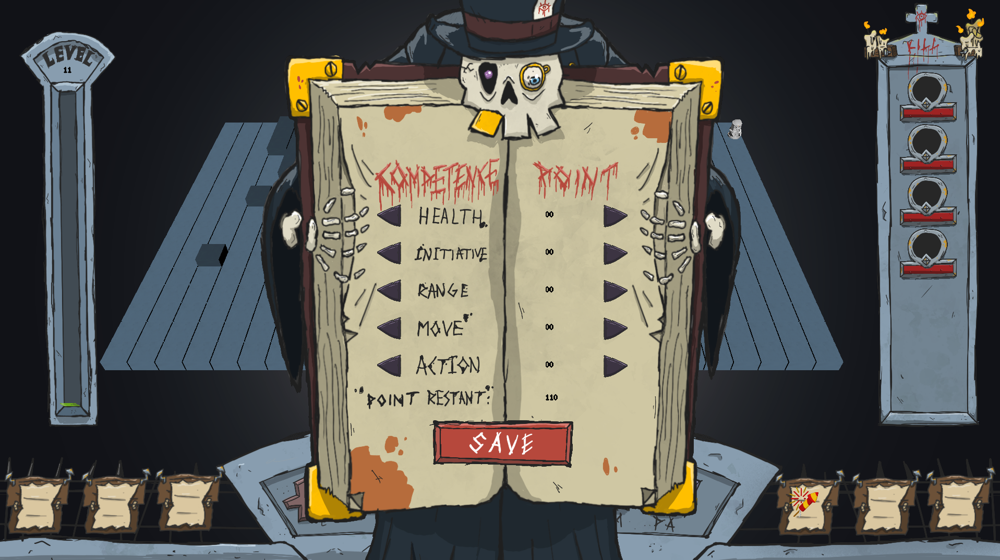
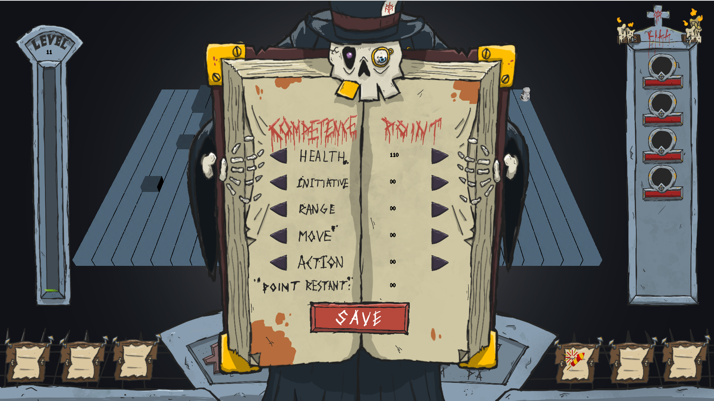
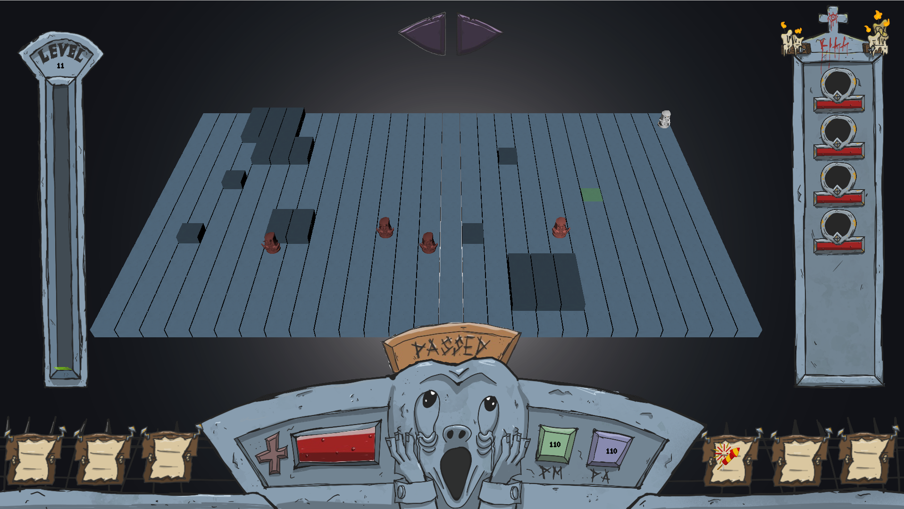
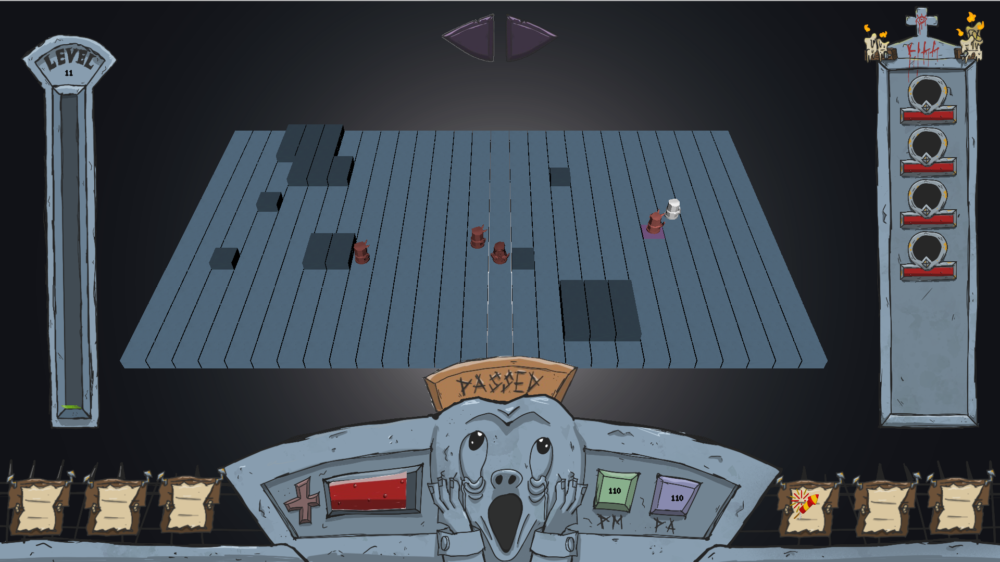
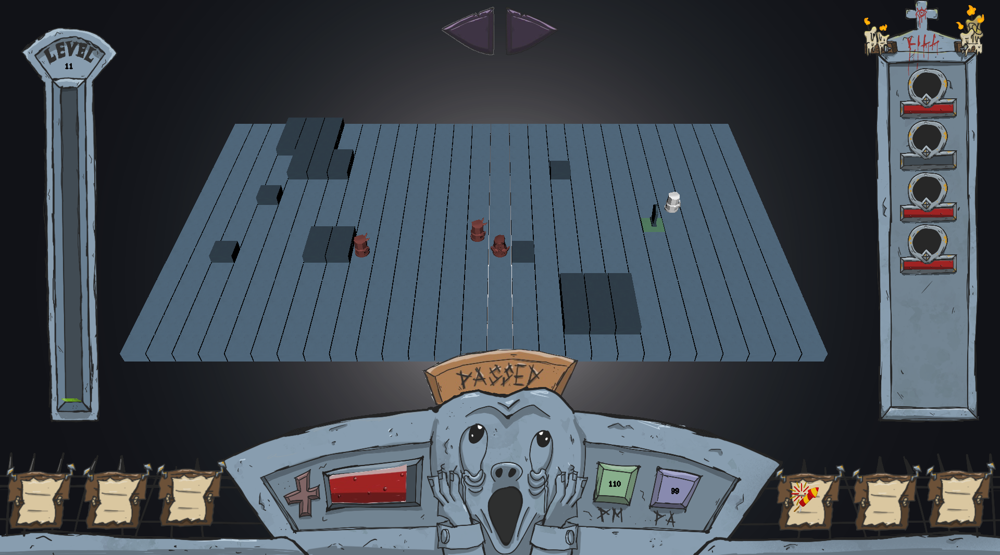
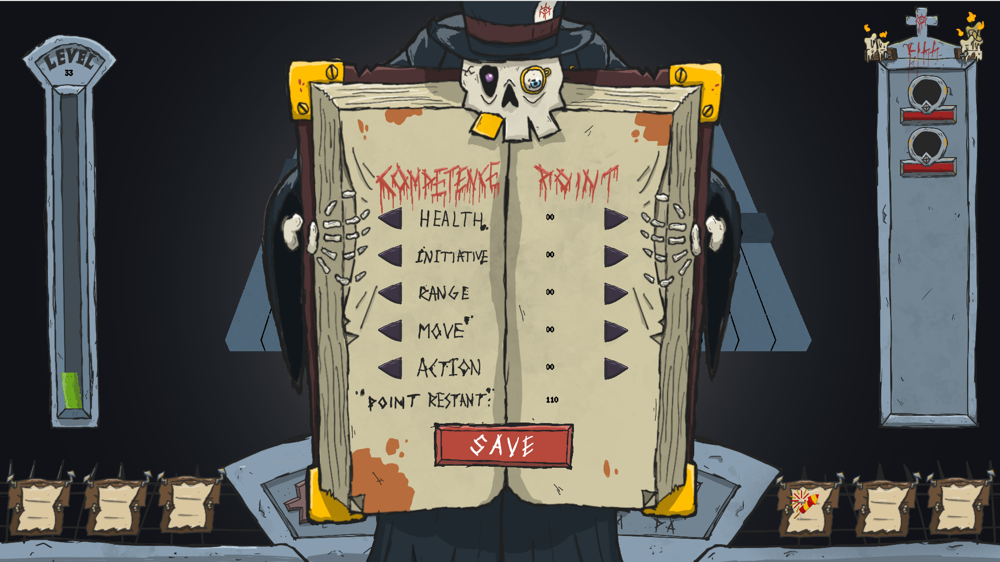

# one must imagine Alph happy

## Auteurs
Raphaël GOSSET p2216446
Yanis LAASSIBI p2210198
Théo LANGE p2211174

## Description
Ce projet a été réalisé dans le cadre d'un projet universitaire de deuxième année de licence informatique. Il s'agit d'un jeu vidéo développé en C++, utilisant le framework gkit et OpenGL pour la création d'interfaces graphiques et la gestion des graphismes.

Le jeu est inspiré des jeux de combat stratégique en tour par tour tel que Dofus et Waven.
Le principe du jeu est de battre chaque niveau représenté par une grille où se trouve le joueur, des monstres et obstacles en vaincant les monstres, lorsqu'un niveau est battu, le joueur passe au niveau suivant et ainsi de suite. Le joueur aura la possibilité d'attribuer des points de compétences durant sa partie, ses choix d'attribution influeront sur sa capacité à venir à bout des niveaux suivants.
one must imagine Alph happy est donc fondamentalement un jeu de die and retry et de highscore, le but d'une partie est d'atteindre le plus haut niveau possible en apprenant des erreurs de sa partie précédente.

Notre objectif principal était de réaliser jeu ambitieux aux fonctionnalités relativement complexes pour les délais qui nous étaient imposé pour tirer un maximum du projet en découvrant quelles étaient les possibilités et difficultés rencontrés dans la réalisation d'un tel projet.

## Captures d'écran










## Installation
Pour installer notre projet, voici les prérequis :
```
git clone git@forge.univ-lyon1.fr:one-must-imagine-alph-happy/one-must-imagine-alph-happy.git
sudo apt install libsdl2-dev libsdl2-image-dev libglew-dev premake4
sudo apt-get update
sudo apt-get install cmake
```
Une fois les prérequis installés, il se rendre dans le répertoire du projet et le build depuis ce répertoire puis lancer l'exécutable comme suit :
```
cd votre/chemin/vers/le/projet/one-must-imagine-alph-happy
cmake -B build
cmake --build build
./bin/OMIAH
```

PS: la documentation Doxygen sera également générée par cmake

## Tutoriel
Lorsque le jeu se lance vous vous trouverez face à une fenêtre d'attribution de vos points de compétences de départ, attribuez tous vos points et appuyez sur SAVE.
Vous êtes maintenance face au premier niveau, les monstres sont représentés en couleur et le joueur est représenté en blanc, vous avez en bas sur votre HUD un certain nombre de PM (points de mouvement) et un certain nombre de PA (points d'action), vous pourrez en faire usage comme bon vous semble avant de passer votre tour.
Pour se déplacer vous viser avec la souris la case sur laquelle vous souhaitez vous déplacer (la case d'arrivée potentielle sera remplie en bleu) et cliquer pour vous y rendre.
Pour attaquer, une fois à portée du monstre vous pourrez cliquer sur l'une de vos compétences (se trouvant en bas, sur les côtés de l'HUD) puis viser sur la grille la ou les cases que vous souhaitez attaquer (la case d'attaque potentielle sera coloriée en rouge) et cliquer pour lancer votre attaque.
Lorsque vous êtes à court de PM et de PA vous pouvez passer votre tour en cliquant sur PASSER.
Ce sera donc au tour des monstres de se déplacer et de vous attaquer jusqu'à ce que cela soit à votre tour à nouveau.
Si Alph est vaincu lors d'un niveau c'est GAME OVER.
Si tous les monstres du niveau sont vaincu, vous passez au niveau suivant.

## Roadmap
→ Implémentation de niveaux spéciaux (niveaux de boss, niveaux requierant une stratégie particulière)
→ Implémentation de l'apparition d'objets bonus dans les niveaux (vies supplémentaires à collecter, etc.)
→ Implémentation du mode Coop.
→ Implémentation du PvP.
